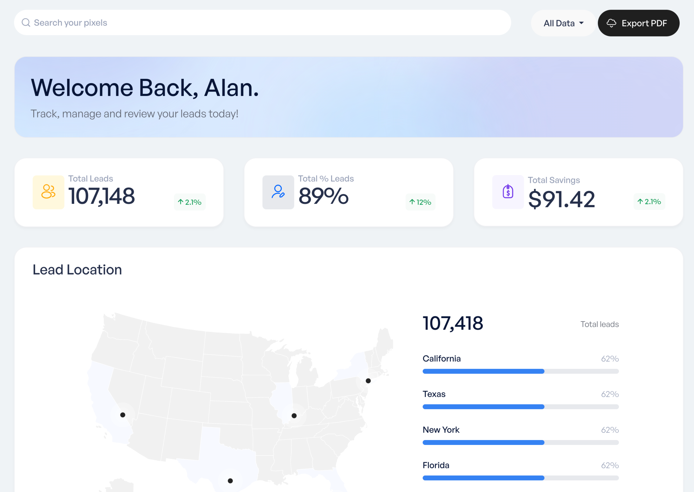

# What to expect from your dashboard

The dashboard is where you'll find the analytics and demographic data from your pixels. All pixel data will be agreggated together for an organization, unless you choose to filter it down to a specific pixel.

The first thing you'll notice on your dashboard are three primary widgets to answer the most common questions we receive:

- **Total Leads**: The total number of leads that you have received of all time.
- **Total % Leads**: The percentage of your traffic that was converted into a lead. Also known as: Match Rate
- **Total Savings**: And how much you've saved on your existing CPL.

While this dashboard defaults to an all-time agreggation of your audiences data, you can use the provided date range and other filtering options to narrow it down and analyze specific pixels or audience segments.

Once you've determined an ideal report for your needs you'll be able to download a PDF version of the dashboard.
