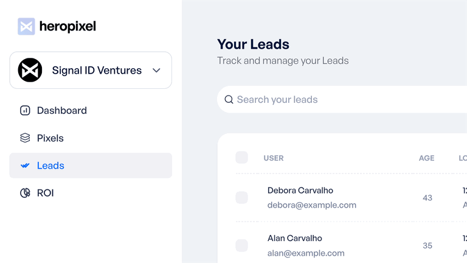

# What can you expect with Hero Pixel?

With our White Glove onboarding process you'll be identifying a massive new audience within the first five minutes. Our library of more than 100+ integrations provide a seamless stream of new leads pouring into your organization.

We have thoroughly refined the user experience to provide you with a simple and intuitive interface, so you can quickly access the audiences and analytics you need to make informed decisions.

## How do you access your leads?

Your dashboard's menu will have a link to the Leads which have been placed into your audience from the pixel. Here you can access all Leads for your organization to review and analyze your audience.

We will only ever display your Leads more than once for a pixel. Again, there will be no duplicate leads for a given pixel. However, leads may be associated with more than one pixel. You will be charged for every pixel that identifies a unique lead to itself.

On your leads list you can search, sort and filter your leads. Once you have the desired filter in place you can request an export. Read more about that in the [getting started section](/docs/start-get-your-leads)

## Automatically sync your leads

We offer more than 100+ integrations, making it possible to create a regular sync of your Leads to many different destinations.

For this reason, after the initial setup of the pixel combined with an integration, you'll rarely need to access your Hero Pixel dashboard.
