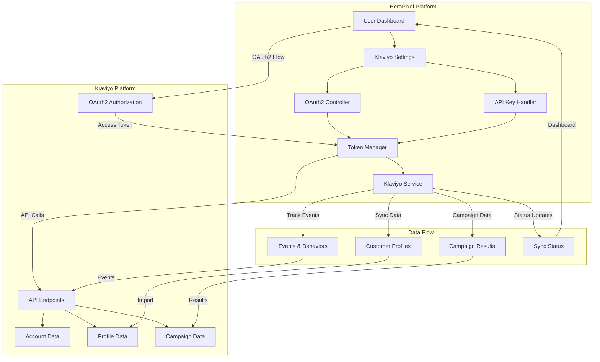

# Klaviyo OAuth2 Integration Documentation

## OAuth App Overview

HeroPixel integrates with Klaviyo via OAuth2 to provide seamless marketing automation and customer data synchronization. The integration enables users to sync customer profiles, events, and manage email campaigns directly from the HeroPixel platform.

**Key Features:**
- Dual authentication support (OAuth2 and API Key)
- Automatic token refresh for OAuth2
- Real-time profile synchronization
- Campaign management and flow automation
- Comprehensive error handling and logging

## Customer Workflow

### Steps required for a customer to set up and utilize the integration:

1. **Navigate to Integration Settings**
   - Log into HeroPixel dashboard
   - Navigate to **Sidebar → Organization Settings → Settings**
   - Click **Klaviyo** in the menu bar
   - **Direct Link**: https://app.heropixel.com/settings/klaviyo
   - Choose authentication method: OAuth2 (recommended) or API Key

2. **OAuth2 Connection (Recommended Method)**
   - Click "Connect with Klaviyo" button
   - Redirect to Klaviyo authorization page
   - Log in to Klaviyo account (if not already logged in)
   - Review and approve requested permissions
   - Redirect back to HeroPixel with successful connection
   - Account ID and tokens automatically stored and managed

3. **API Key Connection (Alternative Method)**
   - Generate Private API Key in Klaviyo (Settings → Account → API Keys)
   - Copy the API key
   - Paste key in HeroPixel API key field
   - Click "Connect with API Key"
   - System validates key and establishes connection

4. **Configure Integration**
   - Select target Klaviyo lists for profile imports
   - Set up automated workflows and flows
   - Configure event tracking and campaign triggers
   - Test connection with sample data
   - Monitor integration status and logs

5. **Manage Integration**
   - View connection status and account details
   - Monitor sync history and error logs
   - **Disconnect Account**: Click "Disconnect" to remove all stored tokens and revoke access
   - Switch between OAuth2 and API Key authentication methods
   - Update settings and preferences

### Connection Status Screens

**Not Connected State:**
 

  

 
 

**Connected State:**
 

  

 

## Integration Details

### Use Cases and Klaviyo API Endpoints

| Use Case | Endpoint(s) | Description |
|----------|-------------|-------------|
| **Profile Management** | `https://a.klaviyo.com/api/profiles/` | Create, update, and retrieve customer profiles with custom attributes |
| **Profile Bulk Import** | `https://a.klaviyo.com/api/profile-bulk-import-jobs/` | Import large batches of profiles efficiently |
| **List Management** | `https://a.klaviyo.com/api/lists/` | Create and manage email lists for campaigns |
| **Event Tracking** | `https://a.klaviyo.com/api/events/` | Track customer events and behaviors |
| **Campaign Management** | `https://a.klaviyo.com/api/campaigns/` | Create and manage email campaigns |
| **Flow Management** | `https://a.klaviyo.com/api/flows/` | Automate marketing workflows and sequences |
| **Account Information** | `https://a.klaviyo.com/api/accounts/` | Retrieve account details and metadata |
| **Subscription Management** | `https://a.klaviyo.com/api/profile-subscription-bulk-create-jobs/` | Bulk subscribe profiles to lists |

### API Version and Authentication
- **API Version**: 2025-10-15
- **Base URL**: https://a.klaviyo.com/api/
- **Authentication**: OAuth2 Bearer Token or API Key
- **Token Refresh**: Automatic for OAuth2 connections

## Architectural Diagram

### Data Flow Explanation

1. **Authentication Flow**
   - User initiates OAuth2 connection from HeroPixel
   - Redirect to Klaviyo for authorization
   - Exchange authorization code for access/refresh tokens
   - Store tokens securely with automatic refresh capability

2. **Data Synchronization**
   - HeroPixel fetches customer profiles and events
   - Data is processed and formatted for Klaviyo API
   - Bulk operations for efficient large-scale imports
   - Real-time event tracking and campaign triggers

3. **Error Handling**
   - Comprehensive logging for all API interactions
   - Automatic retry mechanisms for failed requests
   - User-friendly error notifications
   - Graceful degradation during service interruptions

## Product Integration Demo

### Demo Scenarios

**Scenario 1: OAuth2 Setup and Profile Import**
1. Demonstrate OAuth2 connection flow
2. Show automatic token management
3. Import sample customer profiles
4. Display sync status and results

**Scenario 2: Event Tracking and Campaigns**
1. Track customer events from HeroPixel
2. Create automated email campaigns
3. Monitor campaign performance
4. Show real-time data synchronization

**Scenario 3: API Key Alternative**
1. Generate and configure API key
2. Test connection and validation
3. Compare with OAuth2 method
4. Switch between authentication methods

### Demo Access

For Klaviyo app review purposes, please contact our team to schedule a live demo:

**Contact**: jonathon@heropixel.com  
**Subject**: Klaviyo OAuth2 Integration Demo Request  

We will provide:
- Full access to test HeroPixel account
- Pre-configured Klaviyo test environment
- Step-by-step demonstration of all use cases
- Technical walkthrough of implementation details

## Testing Details

### Test Account Setup

For Klaviyo OAuth flow testing and approval, we provide:

**Test Environment Access:**
- Production HeroPixel instance: `https://www.heropixel.com`
- Test Klaviyo account configured for OAuth testing
- Sample data and pre-configured workflows
- Full API endpoint access for testing

**Access Instructions:**
1. Email `app.marketplace@klaviyo.com` to be added as a team member
2. Or request password reset for the test account
3. Log in and navigate to Settings → Integrations → Klaviyo
4. Test complete OAuth flow and all use cases

### Test Scenarios

**Authentication Testing:**
- OAuth2 authorization flow
- Token refresh mechanisms
- API key validation
- Permission denial handling

**Functional Testing:**
- Profile creation and updates
- Bulk import operations
- Event tracking
- Campaign management
- Error scenarios and recovery

**Security Testing:**
- Token storage and encryption
- API rate limiting
- Data validation and sanitization
- Access control and permissions

## Klaviyo App Review Checklist

### Technical Review ✅

**Integrating with Klaviyo:**
- ✅ Install URL directs user as expected
- ✅ Works while logged into Partner App
- ✅ Works while not logged into Partner App
- ✅ Installation via Partner App is seamless
- ✅ Uninstalling via Partner App successfully removes app in Klaviyo
- ✅ Removing integration via Klaviyo successfully updates Partner App
- ✅ Settings URL directs to an Integration/Settings page
- ✅ Deny permission workflow uses clear language
- ✅ Metrics are supplied and updated as applicable
- ✅ App performs as expected and described

### General Documentation ✅

**Documentation and Form Submissions:**
- ✅ Installation instructions supplied via Manage App page
- ✅ Settings / Install / Support URLs via Manage App page
- ✅ Client-facing documentation available
- ✅ Integration Registration completed
- ✅ Security Questionnaire submitted

### 'To Do' Checklist ✅

**Final Requirements:**
- ✅ Recorded demo of installation and use cases
- ✅ Klaviyo brand guidelines are met and references to Klaviyo are accurate
- ⏳ 5 active user installs (in progress)

## Support and Contact

**Technical Support:**
- Email: support@heropixel.com
- Documentation: https://docs.heropixel.com/klaviyo
- Status Page: https://status.heropixel.com

**Partnership Inquiries:**
- Email: jonathon@heropixel.com
- Subject: Klaviyo Integration Partnership

**Security Concerns:**
- Email: jonathon@heropixel.com
- Response Time: Within 24 hours

---

*Last Updated: January 2026*  
*Version: 1.0*  
*Integration: Klaviyo OAuth2 v2025-10-15*
