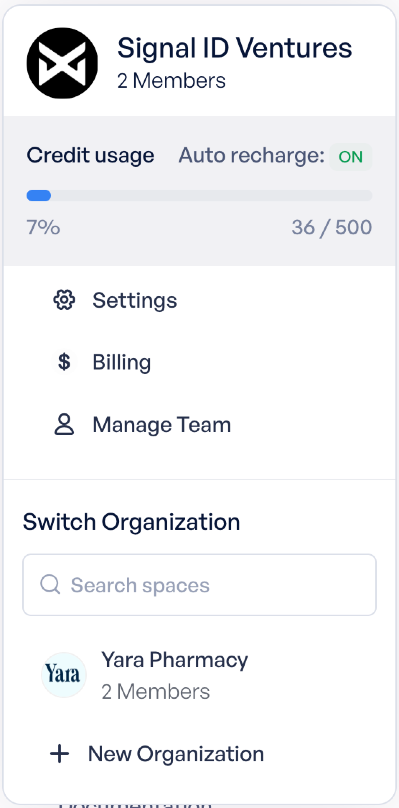

# Organization and Teams Overview

The organization is the pinnacle of the dashboard. All Pixels, Leads, User accounts and billing are associated with an organization. Upon invite or registration your base organization was already created. You can see the currently selected org at the top of the left menu. This is to remind you that all menu items you choose are associated with the selected organization.

When clicking on the organization dropdown you will see the Org Menu, example shown to the right. It's here that you can get a quick view into your orgs credit usage, or choose any of the settings options to enter into the Organization Settings area.

**Changing your Organization**

To change your organization, simply select another org from the list at the bottom of the organization menu. You can create as many organizations as you'd like. Orgs are a way of keeping separate lead lists and being able to associate specific pixels with different billable accounts.

**Managing your Team Members**

You are the owner of any organization you create, which will give you the privileges of inviting new team members to join you in the organization. If you're invited to an organization, you'll most likely start out as a member and not a manager of that org. For this reason you may see different options available to you based on which organization you've currently selected.
